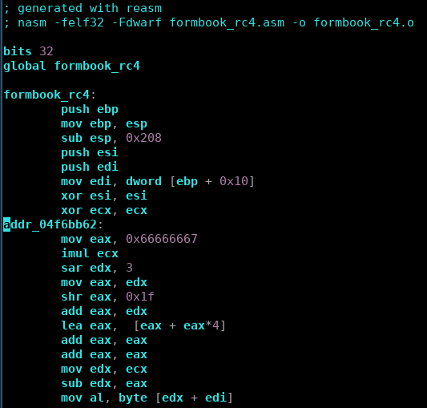
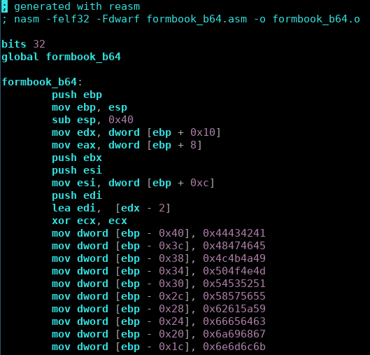
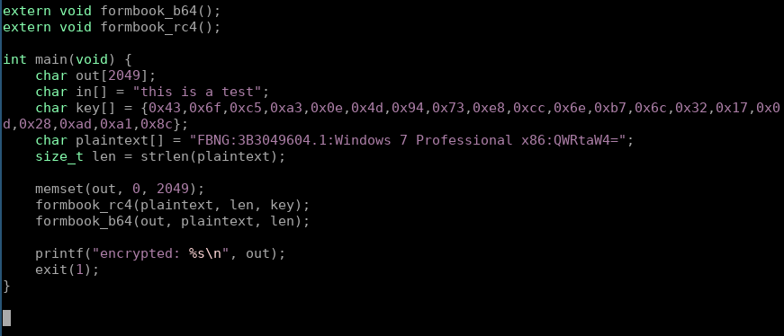
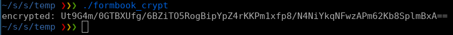
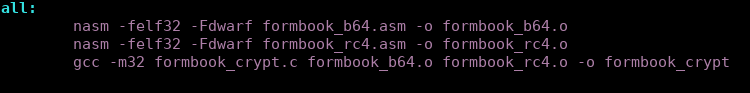

# reasm
Extract algorithms of the malware windows 32bits and re-compile it on linux for decrypting stuff using same malware algorithms.

There are algorithms in the malwre complex to implement in python or other language, and they are changing all the time the implementation, so why no executing their decryption logic instead implementing it in other language?

This is useful for decrypting and encrypting stuff, decompressing and so on.

This tool extract the asm and prepare it to be compilable with nasm, and also prepare the asm and c file to trigger the algorithm.

Powered by Radare.

### Usage
    python3 reasm.py [binary name] [start address] [end address]

    example:
        python3 reasm.py malware_dump.bin 0x04f6bb50 0x0x04f6bc76

### Pics

For example formbook use standard algorithms but modified:

The Makefile:

